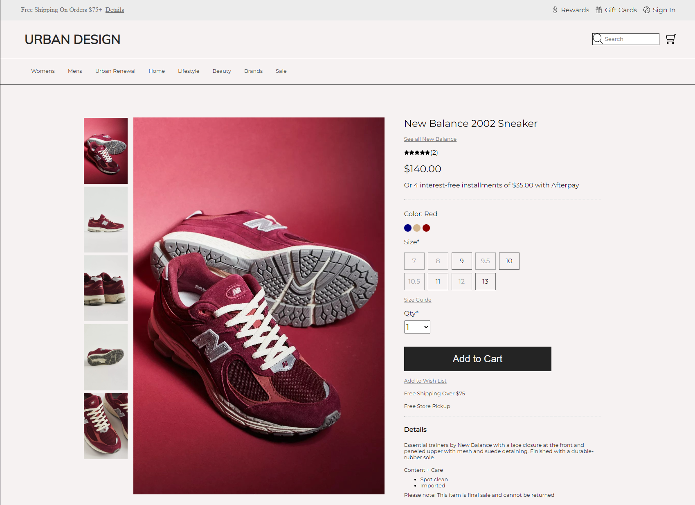
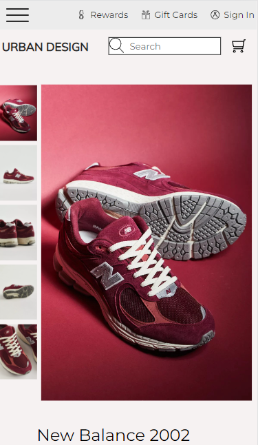

# E-commerce Front-End Static Webpage

## Description

This project is a static webpage of a font-end e-commerce website. This page is interactive, as you can select the images, sizes and color options.
This page is also mobile responsive, with just one singular media query. 

My motivation for building this project was to practice my front-end CSS skills. I really enjoy minimal design, therefore, I went for a design that was inspired by Urban Outfitters. I thought that Urban Outfitters would be great for practice, as they're website is very clean and minimal. Therefore, I took the page as heavy inspiration and guidance when creating this webpage. You can view the page I took inspiration from [here](https://www.urbanoutfitters.com/shop/new-balance-2002-sneaker2?category=mens-clothing&color=204&type=REGULAR&quantity=1).

This project uses the languages HTML, CSS and JavaScript.

The mobile view of this webpage can be viewed below

## Challenges

I encountered many challengeds while creating this page, which is exactly why I created this page, so I can practice and learn from creating in front-end. One of the issues I faced was fitting the header and the body within the 100rem max-width I set for the entirety of the page, which I had to solve one section at a time. 

Another problem I had to fix was fixing the main product image so it doesn't stretch horizontally when resized. I fixed it simply by removing a simple display: flex for the container that held the image.

Lastly, I completed the page by including a hamburger menu. I've never worked with a hamburger menu before, therefore I needed guidance. To create my hamburger menu, I used Erik Terwan's CodePen to help guide me along the way. This CodePen can be viewed [here](https://codepen.io/erikterwan/pen/EVzeRP). I am happy to say now that I have a general idea of how a hamburger menu works, I just need to practice and learn CSS animations.

## Overview and Deployment Link

This project taught me that no matter how minimal a page may be designed or looked, a lot still goes into the development of the actual page. I am happy I got to practice my skills and build a project that can be viewed [here](https://johnclimie.github.io/ecommerce-front-end-practice/).

